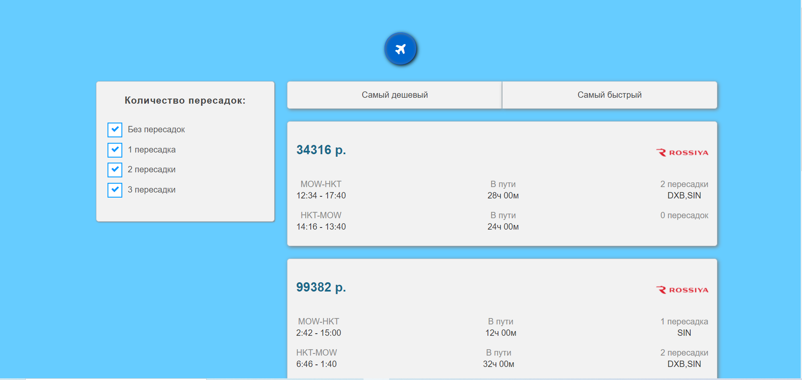

# Приложение по подбору авиабилетов #
### Описание
Реализован клиент, который будет получает случайно сгенерированные билеты от сервера aviasales и отрисует интерфейс,
соотвествующих выбранным фильрам и сортировки. Дополнительно реализована подгрузка билетов по 5 шт.


### Технологии
- React
- Typescript
- Less
- Mobx

### Установка
- клонирование приложения командой
  ```bsh
  git clone https://github.com/PotapenkoVadim/avia-app.git
- установка зависимостей
  ```js
  npm install
- запуск локального сервера
  ```js
  npm run start

### Дополнительно
Подробнее приложение можно посмотреть [тут](https://potapenkovadim.github.io/avia-app/dist/index.html).
Собранный проект в директории dist/.